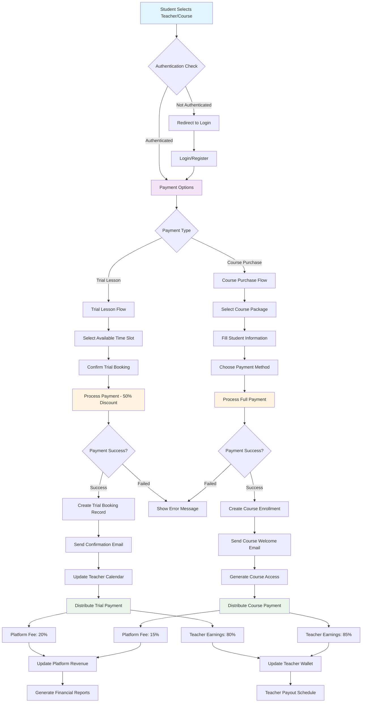
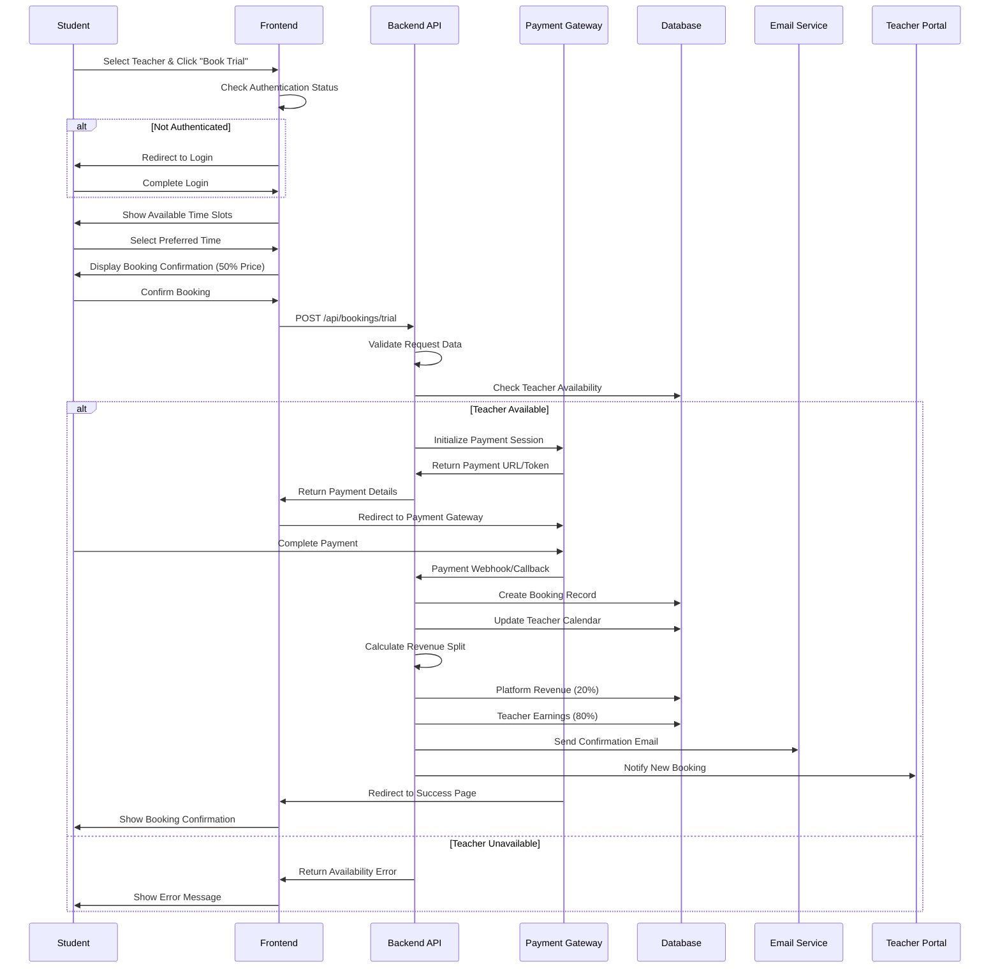
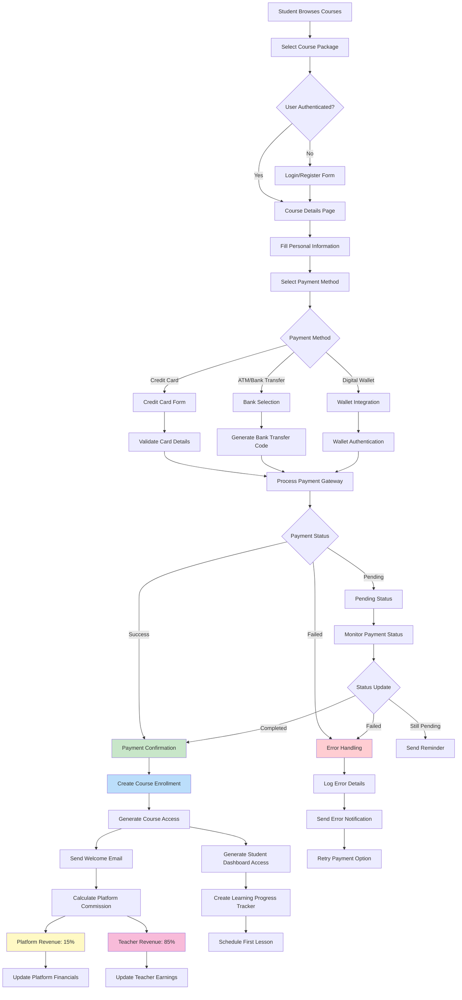
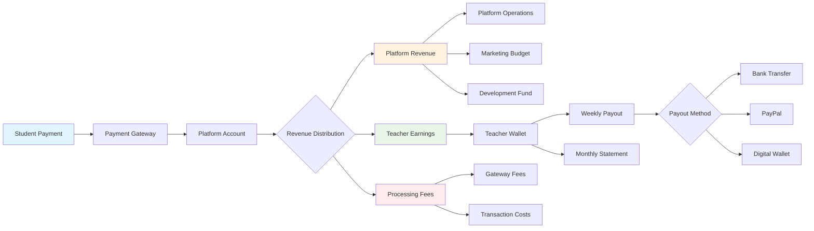
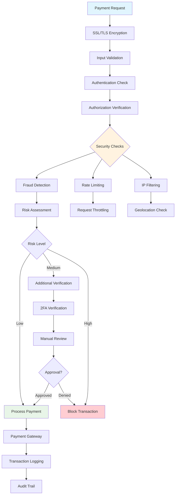
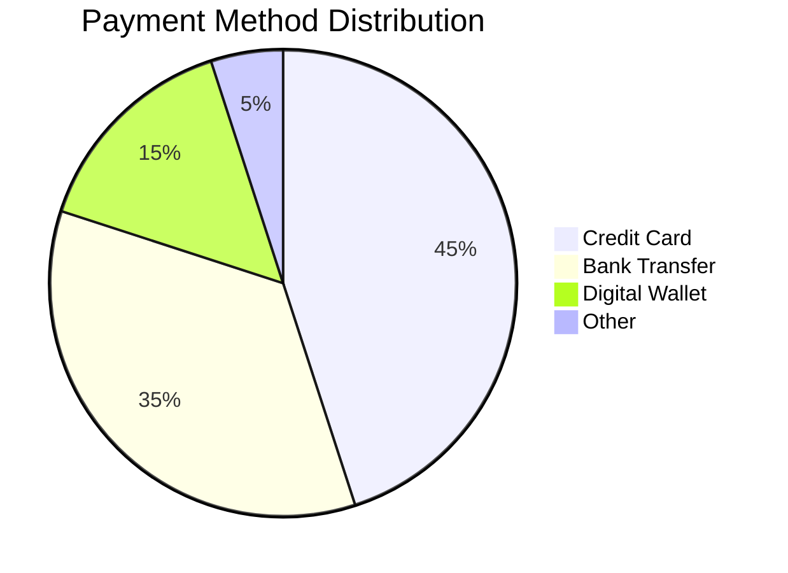
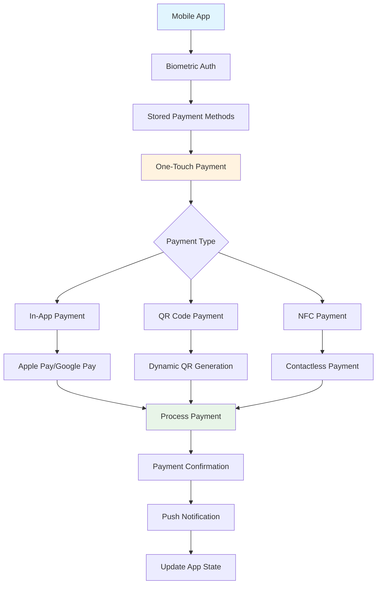

# Antoree Clone - Distributed Payment System Flowchart & Documentation

## 🌟 Overview

The Antoree Clone platform implements a sophisticated **distributed payment system** that handles multiple payment scenarios including trial lessons, course purchases, and teacher earnings distribution. This document provides comprehensive flowcharts and technical documentation for the payment ecosystem.

## 💳 Payment System Architecture

### Core Components
- **Payment Gateway Integration**: Multiple payment methods (Credit Card, ATM, Digital Wallet)
- **Distributed Ledger**: Revenue sharing between platform and teachers
- **Trial Lesson Booking**: Discounted introductory lessons
- **Course Purchase System**: Full course package payments
- **Teacher Payout System**: Automated earnings distribution

---

## 🔄 Main Payment Flow Diagram



---

## 🎯 Trial Lesson Payment Flow

### Detailed Flow Steps



---

## 💰 Course Purchase Payment Flow

### Complete Course Purchase Process



---

## 🏦 Distributed Revenue System

### Revenue Sharing Model

| Payment Type | Platform Fee | Teacher Share | Processing Fee |
|-------------|-------------|---------------|----------------|
| Trial Lesson | 20% | 80% | 2.9% + $0.30 |
| Course Purchase | 15% | 85% | 2.9% + $0.30 |
| Regular Lesson | 18% | 82% | 2.9% + $0.30 |
| Group Class | 12% | 88% | 2.9% + $0.30 |

### Financial Flow Architecture



---

## 📊 Payment Methods Integration

### Supported Payment Gateways

#### 1. Credit Card Processing
```javascript
// Credit Card Payment Flow
const processCreditCardPayment = {
  provider: "Stripe/VNPay",
  supportedCards: ["Visa", "Mastercard", "AMEX", "JCB"],
  securityFeatures: ["3D Secure", "CVV Verification", "Fraud Detection"],
  processingTime: "Instant",
  fees: "2.9% + $0.30"
}
```

#### 2. ATM/Bank Transfer
```javascript
// Bank Transfer Integration
const processBankTransfer = {
  provider: "VNPay/NAPAS",
  supportedBanks: ["Vietcombank", "Techcombank", "BIDV", "MB Bank"],
  processingTime: "1-3 business days",
  fees: "1.5% or fixed fee",
  features: ["QR Code Payment", "Internet Banking", "Mobile Banking"]
}
```

#### 3. Digital Wallets
```javascript
// Digital Wallet Integration
const processWalletPayment = {
  providers: ["MoMo", "ZaloPay", "ViettelPay", "PayPal"],
  processingTime: "Instant",
  fees: "1.5% - 2.5%",
  features: ["One-touch Payment", "Biometric Authentication"]
}
```

---

## 🔐 Security & Compliance

### Payment Security Measures



### Compliance Standards
- **PCI DSS Level 1** compliance for card data
- **GDPR** compliance for EU users
- **Vietnamese Banking Regulations** compliance
- **Anti-Money Laundering (AML)** procedures
- **Know Your Customer (KYC)** verification

---

## 📈 Payment Analytics & Reporting

### Key Performance Indicators (KPIs)

#### Revenue Metrics
- **Total Revenue**: Monthly/Quarterly tracking
- **Teacher Earnings**: Individual and aggregate
- **Platform Commission**: Revenue share tracking
- **Payment Success Rate**: Conversion metrics
- **Average Transaction Value**: Student spending patterns

#### Payment Method Analytics


### Financial Dashboard Components

1. **Revenue Overview**
   - Real-time revenue tracking
   - Monthly growth metrics
   - Teacher payout summaries

2. **Transaction Monitoring**
   - Payment success/failure rates
   - Processing time analytics
   - Error rate tracking

3. **Teacher Earnings**
   - Individual teacher revenue
   - Payout scheduling
   - Performance-based bonuses

---

## 🛠 Technical Implementation

### API Endpoints

#### Payment Processing
```typescript
// Trial Lesson Booking
POST /api/bookings/trial
{
  teacherId: string,
  scheduledAt: string,
  duration: number,
  notes: string
}

// Course Payment
POST /api/payments/simple/course
{
  courseId: string,
  paymentMethod: "captureWallet" | "payWithATM" | "payWithCC",
  studentInfo: StudentInfo,
  couponCode?: string
}

// Payment Status Check
GET /api/payments/{paymentId}/status

// Teacher Earnings
GET /api/teachers/{teacherId}/earnings
```

### Database Schema

#### Payment Records
```sql
CREATE TABLE payments (
  id VARCHAR(255) PRIMARY KEY,
  student_id VARCHAR(255) NOT NULL,
  teacher_id VARCHAR(255),
  course_id VARCHAR(255),
  booking_id VARCHAR(255),
  amount DECIMAL(10,2) NOT NULL,
  platform_fee DECIMAL(10,2) NOT NULL,
  teacher_earnings DECIMAL(10,2) NOT NULL,
  payment_method VARCHAR(50) NOT NULL,
  status ENUM('pending', 'completed', 'failed', 'refunded'),
  gateway_transaction_id VARCHAR(255),
  created_at TIMESTAMP DEFAULT CURRENT_TIMESTAMP,
  updated_at TIMESTAMP DEFAULT CURRENT_TIMESTAMP ON UPDATE CURRENT_TIMESTAMP
);
```

#### Teacher Earnings
```sql
CREATE TABLE teacher_earnings (
  id VARCHAR(255) PRIMARY KEY,
  teacher_id VARCHAR(255) NOT NULL,
  payment_id VARCHAR(255) NOT NULL,
  amount DECIMAL(10,2) NOT NULL,
  status ENUM('pending', 'available', 'paid'),
  payout_date TIMESTAMP NULL,
  payout_method VARCHAR(50),
  created_at TIMESTAMP DEFAULT CURRENT_TIMESTAMP
);
```

---

## 🚀 Demo Implementation Guide

### Quick Start Demo

1. **Setup Payment Gateway Demo**
   ```bash
   # Install dependencies
   npm install stripe vnpay-node

   # Configure environment variables
   STRIPE_PUBLIC_KEY=pk_test_...
   STRIPE_SECRET_KEY=sk_test_...
   VNPAY_MERCHANT_ID=...
   VNPAY_SECRET_KEY=...
   ```

2. **Run Demo Transaction**
   ```javascript
   // Demo trial lesson booking
   const demoBooking = {
     teacherId: "teacher-123",
     scheduledAt: "2024-08-26T14:00:00Z",
     duration: 60,
     notes: "Demo trial lesson"
   };

   // Process demo payment
   const paymentResult = await processTrialPayment(demoBooking);
   console.log("Demo payment result:", paymentResult);
   ```

3. **Test Payment Methods**
   - Credit Card: Use test card `4242 4242 4242 4242`
   - Bank Transfer: Use demo bank account
   - Digital Wallet: Use sandbox environment

### Payment Flow Testing

#### Test Scenarios
1. **Successful Payment Flow**
   - Valid payment details
   - Available teacher slot
   - Proper revenue distribution

2. **Failed Payment Scenarios**
   - Invalid card details
   - Insufficient funds
   - Network timeout

3. **Edge Cases**
   - Concurrent bookings
   - Payment gateway downtime
   - Refund processing

---

## 📱 Mobile Payment Integration

### Mobile-Specific Features



---

## 🔮 Future Enhancements

### Planned Features

1. **Cryptocurrency Payments**
   - Bitcoin/Ethereum support
   - Stablecoin integration
   - DeFi payment protocols

2. **Advanced Revenue Sharing**
   - Dynamic commission rates
   - Performance-based bonuses
   - Loyalty reward programs

3. **International Expansion**
   - Multi-currency support
   - Local payment methods
   - Regional compliance

4. **AI-Powered Features**
   - Fraud detection algorithms
   - Dynamic pricing optimization
   - Personalized payment recommendations

---

## 📞 Support & Troubleshooting

### Common Issues

1. **Payment Failures**
   - Check internet connectivity
   - Verify payment method details
   - Contact payment gateway support

2. **Revenue Distribution Errors**
   - Validate teacher account setup
   - Check platform commission settings
   - Review payout schedules

3. **Security Concerns**
   - Enable 2FA authentication
   - Monitor transaction logs
   - Report suspicious activities

### Contact Information
- **Technical Support**: support@antoree.com
- **Payment Issues**: payments@antoree.com
- **Emergency Hotline**: +84-xxx-xxx-xxxx

---

**Built with ❤️ using modern payment technologies and security best practices**

---

## 📄 Documentation Links

- [API Documentation](./docs/api-documentation.md)
- [Security Guidelines](./docs/security-guidelines.md)
- [Teacher Payout Guide](./docs/teacher-payouts.md)
- [Payment Gateway Integration](./docs/payment-gateways.md)
